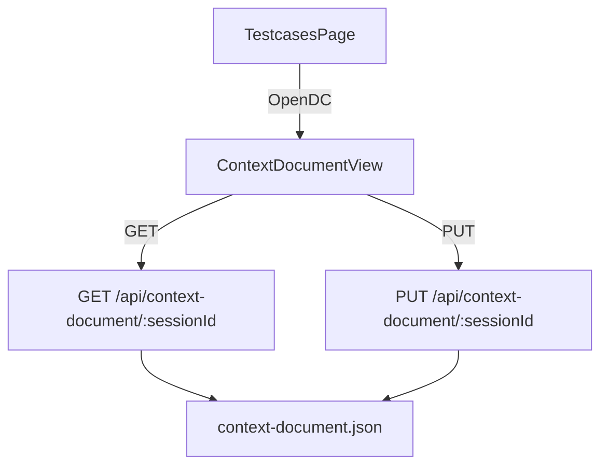

# Fase 1: Documento di Contesto (DC)

## Obiettivo

- Introdurre un **Documento di Contesto** per ogni sessione, come **testo libero**, persistito nel backend come file JSON nella cartella della sessione.
- Rendere il DC **consultabile e modificabile** dall’utente da una nuova schermata UI.
- Non modificare né interferire con RO attuale (Object Autocomplete), TestCaseBuilder, binomi/ec-objects.

## Backend

- Creare un nuovo service per DC basato su file:
  - File: `sessions/<sessionId>/context-document.json`
  - Lettura: se non esiste, restituire un documento vuoto con metadata.
  - Scrittura: validare `text` (string) e salvare con `updatedAt`.
- Aggiungere un nuovo router dedicato (separato da `backend/routes/context.js`):
  - `GET /api/context-document/:sessionId` → `{ document }`
  - `PUT /api/context-document/:sessionId` body `{ text }` → `{ document }`
- Registrare il router in `backend/server.js` con `app.use('/api/context-document', ...)`.

### Contratto dati (MVP)

- `context-document.json`:
  - `version: 1`
  - `createdAt: ISO`
  - `updatedAt: ISO`
  - `text: string`

## Frontend

- Estendere `frontend/src/services/api.js`:
  - `getContextDocument(sessionId)`
  - `saveContextDocument(sessionId, text)`
- Aggiungere una nuova schermata `ContextDocumentView`:
  - textarea full-page
  - bottoni: Salva, Ricarica, Indietro
  - stato loading/error minimale
- Integrare la navigazione in `frontend/src/App.jsx`:
  - aggiungere `step === 'context-doc'`
  - aggiungere un bottone nella **testcases header toolbar** (accanto ai bottoni rotondi) per aprire la schermata DC
  - passare `currentSession.id` alla view

## Flusso

## Non conflitto con l’esistente

- Non viene toccato `backend/routes/context.js` (extract contesto).
- Non vengono toccati gli endpoint `ec-objects` e `binomi`.
- Nessuna modifica a `handleObjectAutocomplete()` o `TestCaseBuilder.jsx` in questa fase.

## Criteri di completamento

- Da UI (lista test case) si apre la schermata DC.
- Alla prima apertura (file assente) appare testo vuoto senza errori.
- Scrivo testo → Salva → ricarico → testo persiste.

## Todo (sequenza implementativa)

- **be-context-doc-service**: Implementare service backend per leggere/scrivere `sessions/<sessionId>/context-document.json` (default se mancante).
- **be-context-doc-routes**: Aggiungere router `/api/context-document` con GET/PUT e registrarlo in `backend/server.js`.
- **fe-context-doc-api**: Aggiungere metodi `api.getContextDocument/api.saveContextDocument` in `frontend/src/services/api.js`.
- **fe-context-doc-view**: Creare schermata `ContextDocumentView` (textarea + Salva/Ricarica/Indietro).
- **fe-app-nav-button**: Integrare step `context-doc` e bottone di accesso nella pagina testcases in `App.jsx`.